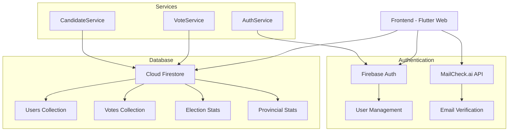
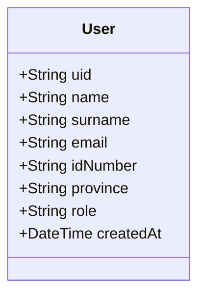
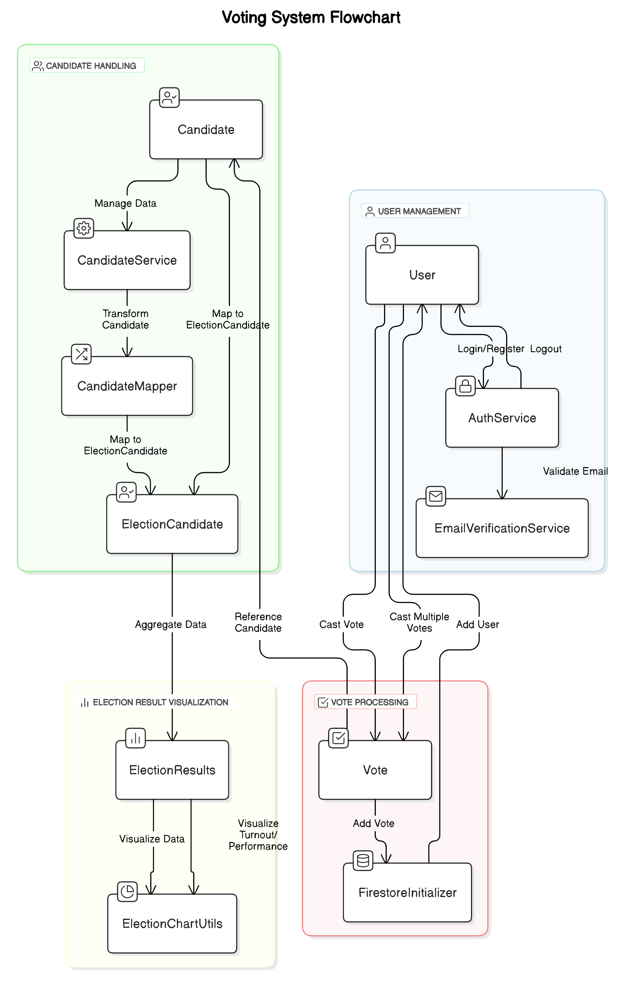
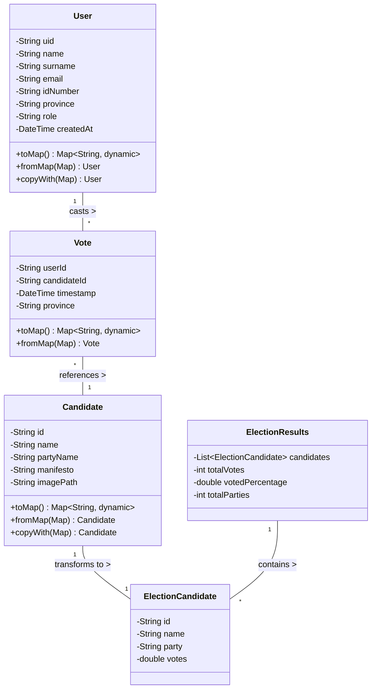
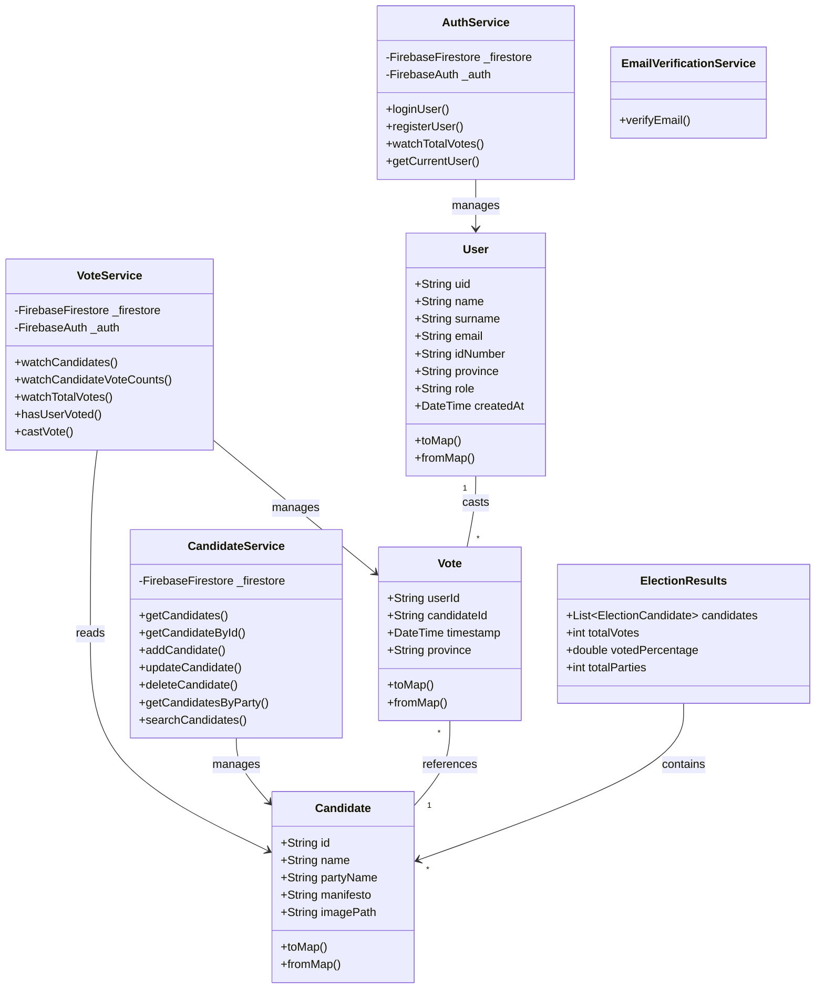

# Election Platform (PSystem)

## Overview
A digital election platform enabling secure online voting, real-time result tracking, and voter verification, developed for the UCT INF4027W Systems Development Project II 2025 entrance exam.

## Features
- User registration with email verification (MailCheck.ai)
- Secure authentication system
- Real-time voting and result tracking
- Provincial-level vote tracking
- Role-based access control (Guest, Voter, Admin)
- Responsive design
- Single vote enforcement per user
- Live polling results

## Tech Stack
### Frontend
- Flutter
- Dart

### Backend
- Firebase
  - Cloud Firestore
  - Firebase Authentication
  - Firebase Hosting

### APIs
- MailCheck.ai for email verification

## System Architecture

### Role-based Access

#### Registered Voter Access
- User registration with ID verification
- Secure voting interface
- Profile management

#### Guest Access
- View live poll results
- Access public election information

### Database Design (Firebase)
#### Users


### Collections
- `users`: Voter information and authentication data
- `votes`: Individual vote records
- `election_stats`: Overall election statistics
- `provincial_stats`: Province-specific statistics
- `provincial_votes`: Vote distribution by province

## Setup and Installation

### Firebase Credentials
Access has been granted to the Firebase project to [**(elsjescott@gmail.com**], [**ammarcanani@gmail.com**]. Please contact the project owner for access, [**mulalorasivhaga@icloud.com**].
### Prerequisites
- Flutter SDK (latest version)
- Firebase CLI
- Git

### Installation Steps

1. Clone the repository
```bash
git clone [https://github.com/mulalorasivhaga/election_platform]
cd election-platform
```

2. Install dependencies
```bash
flutter pub get
```

3. Configure Firebase
  - Create a new Firebase project
  - Enable Authentication and Firestore
  - Replace the Firebase configuration in `lib/firebase_options.dart`

4. Configure MailCheck.ai
  - Sign up for a MailCheck.ai account
  - Update the API key in `lib/features/auth/services/email_verification_service.dart`

5. Run the application
```bash
flutter run -d chrome
```

## Core Functionality

### User Registration
- Email validation through MailCheck.ai
- ID number verification
- Province selection
- Duplicate registration prevention

### Authentication
- Secure login system
- Password encryption
- Session management
- Role-based access control

### Voting System
- One-time vote enforcement
- Real-time vote recording
- Concurrent voting handling using transactions
- Province-based vote tracking

### Results Display
- Real-time result updates
- Provincial vote distribution
- Overall election statistics
- Voter turnout tracking

## Security Features
- Email verification to prevent disposable email addresses
- Secure password handling
- Transaction-based vote recording
- Input validation and sanitization
- Protected routes and authenticated access

## Data Models

### User Model
```dart
class User {
  final String uid;
  final String name;
  final String surname;
  final String email;
  final String idNumber;
  final String province;
  final String role;
  final DateTime createdAt;
}
```

### Vote Model
```dart
class Vote {
  final String userId;
  final String candidateId;
  final DateTime timestamp;
  final String province;
}
```

### Candidate Model
```dart
class Candidate {
  final String id;
  final String name;
  final String partyName;
  final String manifesto;
  final String imagePath;
}
```

## Project Structure

```
lib/
├── config/
│   ├── routes.dart
│   └── firebase_config.dart
│   
├── features/
│   ├── auth/
│   │   ├── models/
│   │   ├── screens/
│   │   └── services/
│   ├── home/
│   ├── results/
│   └── user_dashboard/
├── shared/
│   ├── widgets/
│   ├── services/
│   └── providers/
└── main.dart
```

## image of flow chart


# Class Diagrams
## Simplified


## Comprehensive


## UI Components
- Responsive navigation system
- User dashboard
- Voting interface
- Results visualization
- Profile management

## Known Limitations
- Maximum voter population set to 100 for demonstration
- Election Commission access not implemented
- Limited to email-based authentication

## Future Enhancements
- Implement Election Commission access
- Add advanced search and filtering capabilities
- Enhance analytics features
- Add more sophisticated event handling
- Implement real ID verification integration


## Development Guidelines
- Follow Flutter best practices
- Maintain clean architecture principles
- Use proper error handling
- Document all major functions
- Implement proper logging

## Contact
For any queries regarding this project, please contact [**mulalorasivhaga@icloud.com**].

## Acknowledgments
- Flutter
- Pub.dev
- Firebase
- MailCheck.ai
- University of Cape Town